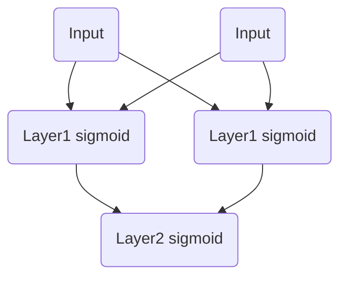

# Numpy Neural Network

```
         ,--.                  ,--.                  ,--. 
       ,--.'|                ,--.'|                ,--.'| 
   ,--,:  : |            ,--,:  : |            ,--,:  : | 
,`--.'`|  ' :         ,`--.'`|  ' :         ,`--.'`|  ' : 
|   :  :  | |         |   :  :  | |         |   :  :  | | 
:   |   \ | :         :   |   \ | :         :   |   \ | : 
|   : '  '; |         |   : '  '; |         |   : '  '; | 
'   ' ;.    ;         '   ' ;.    ;         '   ' ;.    ; 
|   | | \   |         |   | | \   |         |   | | \   | 
'   : |  ; .'         '   : |  ; .'         '   : |  ; .' 
|   | '`--'           |   | '`--'           |   | '`--'   
'   : |               '   : |               '   : |       
;   |.'               ;   |.'               ;   |.'       
'---'                 '---'                 '---'         
                                                          
```

**Numpy Neural Network**(NNN) is neural network framework based on only [numpy](https://www.numpy.org/).

**NNN** support *activations*, *metrics*, *layers*, *optimizers* and *loss functions*. You can build network same as [keras](https://keras.io) on [tensorflow](https://www.tensorflow.org).

Below code, create two-layer network using *sigmoid* as activation, solving problem given as assignment. You can use the same interface for *numpy* and *tensorflow*, depending on whether you define `nn` as `tf.keras` or `nnn`.

```python
model = nn.Sequentail([
    nn.layers.Dense(2, input_dim=2, activation='sigmoid'),
    nn.layers.Dense(1, input_dim=2, activation='sigmoid'),
])
```

**NNN** also support optimzers (from now, only support `SGD` and `Adam`). You can easily define it as you do in *tensorflow*.

```python
optimizer = nn.optimizers.sgd(lr=.1)
```

After compile you model, use `fit` and `evaluate` to train and test model.

```
model.fit(train.X, train.Y, epochs=100)
loss, acc = model.evaluate(test.X, test.Y)
```

## Base Network Architecture



In this assignment, use `SGD` as optimizer, `BCE` as loss function and `sigmoid` as activation function. Each test performed on 128 dataset with 5000 epoch, learning rate 0.1. The random seed is fixed at 2.

## Comparison Results

| %    | Base  | LR[.5] | LR[.01] | Loss[MSE] | Data[256] | Data[2048] |
| ---- | ----- | ------ | ------- | --------- | --------- | ---------- |
| TF   | 96.95 | 97.97  | 96.88   | 97.11     | 97.27     |            |
| NNN  | 97.27 | 96.88  | 69.92   | 97.27     | 95.86     | 96.45      |


```
100%|██████████| 10/10 [00:10<00:00,  1.02it/s, loss=0.1082, mean=97.27%, score=95.31%]

100%|██████████| 10/10 [09:53<00:00, 59.25s/it, loss=0.0841, mean=96.95%, score=98.44%]


```

