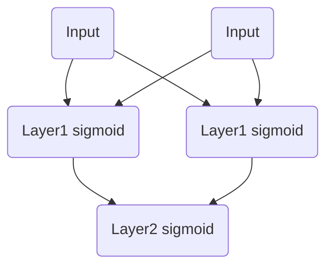

# Numpy Neural Network

```
         ,--.                  ,--.                  ,--. 
       ,--.'|                ,--.'|                ,--.'| 
   ,--,:  : |            ,--,:  : |            ,--,:  : | 
,`--.'`|  ' :         ,`--.'`|  ' :         ,`--.'`|  ' : 
|   :  :  | |         |   :  :  | |         |   :  :  | | 
:   |   \ | :         :   |   \ | :         :   |   \ | : 
|   : '  '; |         |   : '  '; |         |   : '  '; | 
'   ' ;.    ;         '   ' ;.    ;         '   ' ;.    ; 
|   | | \   |         |   | | \   |         |   | | \   | 
'   : |  ; .'         '   : |  ; .'         '   : |  ; .' 
|   | '`--'           |   | '`--'           |   | '`--'   
'   : |               '   : |               '   : |       
;   |.'               ;   |.'               ;   |.'       
'---'                 '---'                 '---'         
```

**Numpy Neural Network**(NNN) is neural network framework based on only [numpy](https://www.numpy.org/) which is fundamental package for scientific computing with Python.

**NNN** support *activations*, *metrics*, *layers*, *optimizers* and *loss functions*. You can build network with high-level expressions like [keras](https://keras.io) on [tensorflow](https://www.tensorflow.org) or [PyTorch](https://pytorch.org).

Below code, create two-layer network using *sigmoid* as activation, solving problem given as assignment. You can use the same interface for *numpy* and *tensorflow*, depending on whether you define `nn` as `tf.keras` or `nnn`.

```python
model = nn.Sequentail([
    nn.layers.Dense(2, input_dim=2, activation='sigmoid'),
    nn.layers.Dense(1, input_dim=2, activation='sigmoid'),
])
```

**NNN** also support optimzers (from now, only support `SGD` and `Adam`) Loss (support `MSE` and `BCE`) and Metric(only `accuracy` now). You can easily define it as you do in *tensorflow*.

```python
optimizer = nn.optimizers.sgd(lr=.1)
loss_function = nn.losses.MSE()
metric = nn.metrics.accuracy()
```

After compile you model, use `fit` and `evaluate` to train and test model.

```
model.fit(train.X, train.Y, epochs=100)
loss, acc = model.evaluate(test.X, test.Y)
```


## Run!

There are several arguments for define task. You can run *numpy* and *tensorflow* implementations using the `--mode` flag as `np` or `tf`. Also you can set `epoch`, `size`, `lr`, `optimizer`, `loss`, `layer`, `repeat` and `seed` flags.

```
python main.py --mode tf --epoch 5000 --size 128 --lr .1 
--optimizer SGD --loss binary_corssentropy --repeat 10
```

## Base Network Architecture



In this assignment, use `SGD` as optimizer, `BCE` as loss function and `sigmoid` as activation function. Each test performed on 128 dataset with 5000 epoch, learning rate 0.1. The random seed is fixed at 2.

## Data

`utils.data.Dataset` generate a random sample from *standard normal* distribution using `np.random.randn`. Set normalized dataset with `--normal` flag.

`utils.data.Dataset` generate labels from `X`, `Y` where $X^2>Y$. If you want custom dataset, override `utils.data.Dataset` and define `X` and `Y`.


## Comparison Results

| %    | Base  | LR[.5] | LR[.01] | Loss[MSE] | Data[Normal] | Data[256] | Data[2048] |
| ---- | ----- | ------ | ------- | --------- | ------------ | --------- | ---------- |
| TF   | 96.95 | 97.97  | 96.88   | 97.11     | 97.27        | 97.27     |            |
| NNN  | 97.27 | 96.88  | 69.92   | 97.27     | 95.94        | 95.86     | 96.45      |


